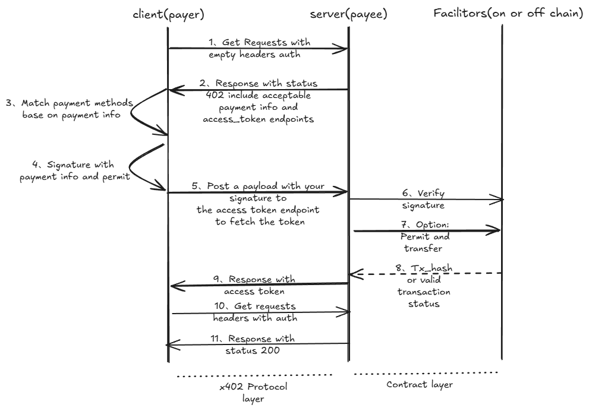

# x402-mock

  

> Directory: [Index](./docs/index.md)

> Quick Start: [Quick Start](./docs/quick_start.md)

> Documentation: [Reference](./docs/reference.md)

> Code Examples: [example](./example/)

> 📚 Protocol Primer: [What EVM protocols does x402-mock use?](./docs/evm_docs.md) ([Chinese version](./docs/evm_docs.zh.md))

---

> 🌟 If you find this project or its documentation helpful, please consider giving us a **Star** — it means a great deal to us. Thank you for your support!  

## Project Overview: x402-mock

x402-mock is an open-source payment integration solution designed for AI Agents and server-side developers. Our core goal is to provide a plug-and-play SDK that helps developers quickly implement on-chain payment and transfer functionality on their own servers, without dealing with complex payment logic from scratch.

Beyond being a practical utility plugin, We are also dedicated to making HTTP 402 and blockchain protocols easier to understand for everyone through our guides and documentation. We are organizing and refining detailed documentation to help users who want to understand AI payments and on-chain protocols get up to speed quickly. Whether you need to solve payment requirements in a project or want to dive deep into related protocol standards, x402-mock provides comprehensive support from code implementation to theoretical reference, helping to drive development efficiency in the AI payment ecosystem.

---

## Flow Diagram

> 📌 See the complete interaction flow diagram below
> 

---

[**Website**](https://openpayhub.github.io/x402-mock/)

### Network Selection Recommendations

**Before using in production, it is strongly recommended to test thoroughly on a testnet first:**

- **Recommended Testnets**: Sepolia (Ethereum), Mumbai (Polygon), etc.
- **Test Assets**: Free test ETH and test USDC are available via each chain's official Faucet
- **Verification**: Confirm that the full payment flow, on-chain settlement, and error handling work as expected

Once testing passes, you can switch to mainnet for production deployment.

---

## Current Status

* ✅ Full HTTP 402 payment workflow
* ✅ Client → Server request and response
* ✅ Payment method negotiation and matching
* ✅ USDC: ERC-3009 offline signature & verification (more gas-efficient)
* ✅ Generic ERC20: Permit2 offline signature & verification (covers most ERC20 tokens)
* ✅ On-chain USDC transfer with tx_hash available
* ✅ Asynchronous on-chain settlement, non-blocking
* ✅ EVM chain coverage, theoretically supports signatures for all tokens (Ethereum, Polygon, Arbitrum, Optimism, etc.)
* 🚀 Production-grade runnable implementation

---

## Roadmap

* [ ] Support smart contract wallet recipients
* [ ] Support EIP-6492 (undeployed contract signature verification)
* [ ] Support SVM (Solana Virtual Machine) and Solana ecosystem
* [ ] Integration with large language model calls

---

## Statement & Recommendations

This module is production-capable, but before deploying to production, please note:

⚠️ **Strongly recommended to test thoroughly on a testnet (e.g., Sepolia) first**
✅ Confirm that the full payment flow, error handling, and on-chain settlement work as expected
🔒 If used with real assets, be sure to complete a security audit and risk controls
💰 It is recommended to set reasonable per-transaction limits and risk management mechanisms

---

If you are researching:

* x402 protocol
* Agent economic systems
* Automated on-chain payments

Welcome to collaborate and contribute.